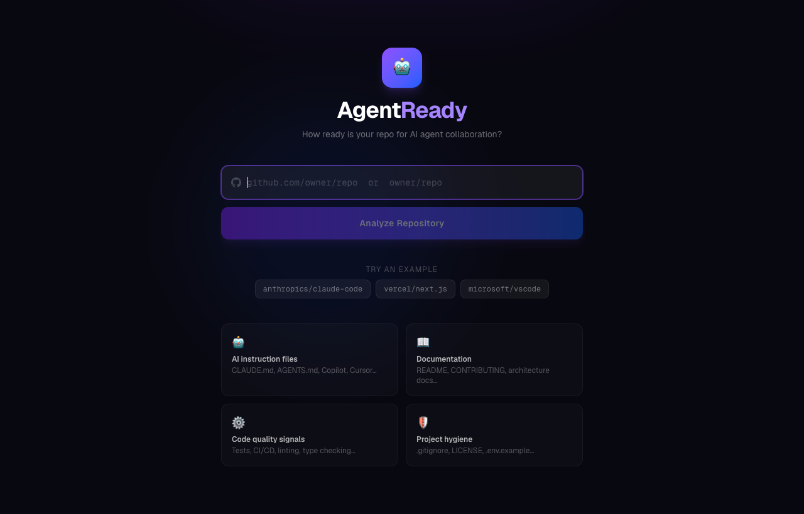

# AgentReady

[](https://agentready.davidcjw.com/results/davidcjw/agentready) 

**How ready is your GitHub repo for AI agent collaboration?**

AgentReady analyzes your repository's agent instruction files (AGENTS.md, CLAUDE.md, Copilot instructions, Cursor rules) for actual content quality — not just presence — and returns a 0–10 score with an embeddable badge and a detailed per-signal report.

🔗 **[agentready.davidcjw.com](https://agentready.davidcjw.com)**

<p align="center">
  
</p>

## Table of Contents

- [What it checks](#what-it-checks)
- [Score tiers](#score-tiers)
- [Embeddable badge](#embeddable-badge)
- [Development](#development)
- [Stack](#stack)
- [Contributing](#contributing)
- [Code of Conduct](#code-of-conduct)
- [License](#license)

## What it checks

### AI Instruction File (65 pts)
The primary signal. Scored on **which file type** is present and **what the content contains**:

| Signal | Points |
|---|---|
| File type (AGENTS.md = 20, CLAUDE.md / Copilot = 16, Cursor = 13, legacy = 10) | 20 |
| Executable commands in code blocks | 15 |
| Explicit constraints (ALWAYS / NEVER / AVOID…) | 12 |
| Test / build commands documented | 10 |
| Structured sections (3+ headers) | 5 |
| Architecture / directory overview | 3 |

### README (25 pts)
| Signal | Points |
|---|---|
| Code examples / commands | 8 |
| Structured with 3+ sections | 7 |
| Setup / installation instructions | 5 |
| Architecture / project overview | 5 |

### CONTRIBUTING.md (10 pts)
| Signal | Points |
|---|---|
| Contains runnable commands | 6 |
| Test / build workflow documented | 4 |

## Score tiers

| Score | Tier |
|---|---|
| 9–10 | Elite |
| 7–8.9 | Ready |
| 5–6.9 | Developing |
| 3–4.9 | Minimal |
| 0–2.9 | Not Ready |

## Embeddable badge

```markdown
[](https://agentready.davidcjw.com/results/owner/repo)
```

## Development

```bash
npm install
npm run dev
```

Open [http://localhost:3000](http://localhost:3000).

### Environment variables

| Variable | Required | Description |
|---|---|---|
| `GITHUB_TOKEN` | No | GitHub personal access token. Without it, unauthenticated requests are limited to 60/hr. |

### Routes

| Route | Description |
|---|---|
| `GET /` | Landing page |
| `GET /results/[owner]/[repo]` | Analysis results page |
| `POST /api/analyze` | JSON analysis API |
| `GET /api/badge/[owner]/[repo]` | SVG badge |

## Stack

Next.js 16 · TypeScript · Tailwind CSS · GitHub REST API

## Contributing

Contributions are welcome! Please open an issue first to discuss what you'd like to change.

1. Fork the repo
2. Create a feature branch (`git checkout -b feature/your-feature`)
3. Commit your changes (`git commit -m 'feat: describe change'`)
4. Push and open a pull request

Please make sure `npm run lint` and `npm run build` pass before submitting a PR.

## Code of Conduct

This project follows the [Contributor Covenant v2.1](https://www.contributor-covenant.org/version/2/1/code_of_conduct/).
By participating you agree to uphold a welcoming, harassment-free environment.

## License

Distributed under the MIT License. See [LICENSE](LICENSE) for details.
